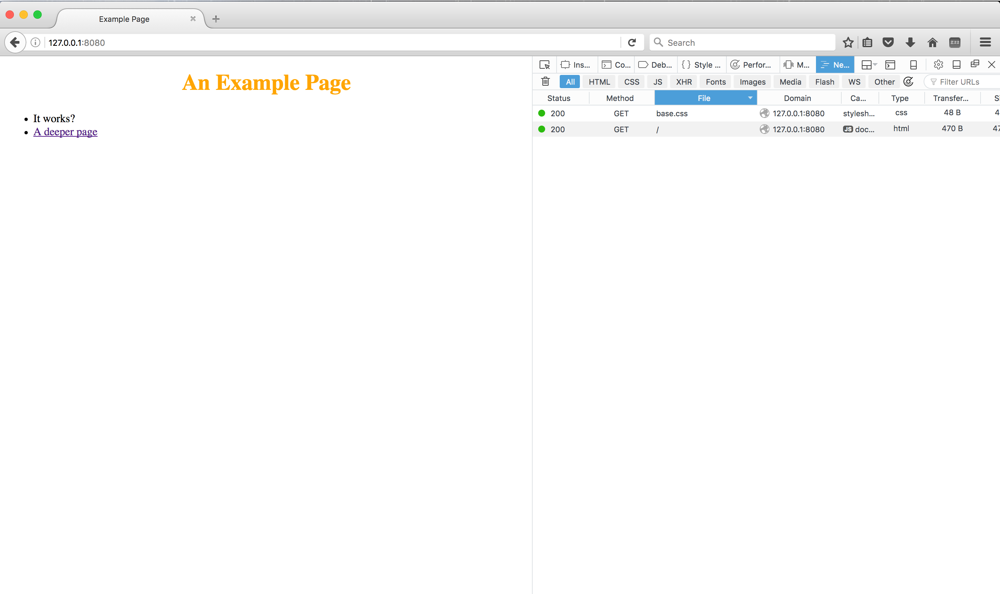
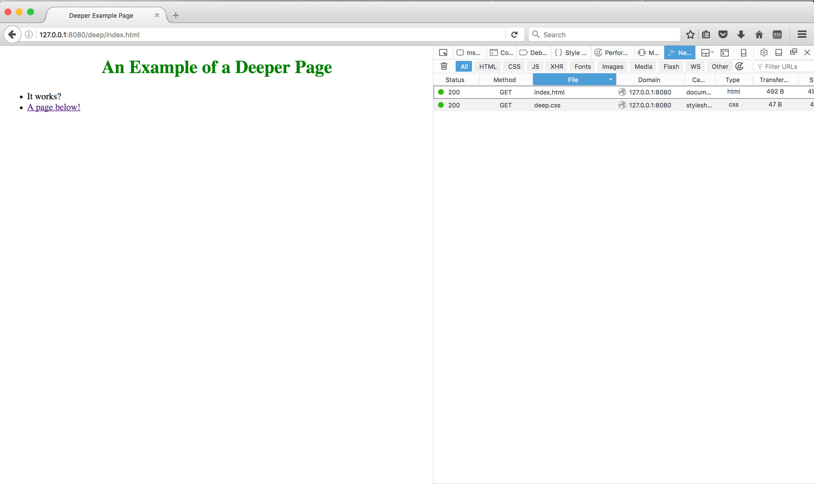

CMPUT404-assignment-webserver
=============================

CMPUT404-assignment-webserver

See requirements.org (plain-text) for a description of the project.

Make a simple webserver.

Contributors / Licensing
========================

Generally everything is LICENSE'D under the Apache 2 license by Abram Hindle.

server.py contains contributions from:

* Abram Hindle
* Eddie Antonio Santos
* Conner Dunn

But the server.py example is derived from the python documentation
examples thus some of the code is Copyright © 2001-2013 Python
Software Foundation; All Rights Reserved under the PSF license (GPL
compatible) http://docs.python.org/2/library/socketserver.html

Resources Used
==============
* [Python 2 Docs For MimeTypes](https://docs.python.org/2/library/mimetypes.html#module-mimetypes) accessed Jan 22, 2017
* [Python 2 Docs For Built-in Types](https://docs.python.org/2/library/stdtypes.html#bltin-file-objects) accessed Jan 22, 2017
* [Python 2 Docs For OS](https://docs.python.org/2/library/os.html) accessed Jan 22, 2017
* [Python 2 Docs For OS.path](https://docs.python.org/2/library/os.path.html#module-os.path) accessed Jan 22, 2017
* [Python 2 Docs For Inspect](https://docs.python.org/2/library/inspect.html) accessed Jan 22, 2017
* [Python 2 Docs For Socket](https://docs.python.org/2.7/library/socket.html?highlight=sendall#socket.socket.sendall) accessed Jan 22, 2017
* [Docs For rfc2616](https://docs.python.org/2.7/library/socket.html?highlight=sendall#socket.socket.sendall) accessed Jan 22, 2017

Screen Shots
============

